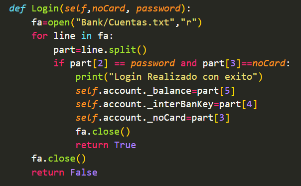

# SISTEMA BANCARIO EN PYTHON

### Alumno: Antonio Ramos Gonzalez
### Matricula: 372576
### Maestro: Carlos Gallegos
### Materia: Paradigmas de la programacion
### Fecha de entrega: 30 de mayo de 2024

#### Introduccion:
El paradigma de Programacion Orientada a Objetos nos permite codificar clases, las cuales estan basadas en objetos reales o en conceptos abstractos. Esta clases actuan como plantillas que definen las propiedades y el comportamiento de los objetos que se estan creando a partir de ellas.
#### Desarrollo:
Como actividad se nos pidio crear una aplicacion en Python usando POO, la cuan debe de cumplir con los siguientes requisitos.
* Hacer uso de clases
* Hacer uso de objetos
* Hacer uso de abstraccion de datos
* Hacer uso de encapsulamiento
* Hacer uso de herencia
* Hacer uso de polimorfismo 

Para la creacion de la app el grupo quedo en hacer un **sistema bancario**, el cual permita realizar **depositos**, **retiros**, **checar estado de cuenta**, y **transferir** a otros usuario del banco.

Para la realizacion de la aplicacion se hizo uso de 3 clases. Clase Person, Clase User (Que hereda atributos de clase Person) y clase BankClass. Tambien se hace uso de harchivos de texto para almacenar las cuentas de los usuarios y poder acceder a ellas aunque el programa haya finalizado

**Clase Person**

**Clase User:**
Hereda los atributos de la clase Person y se encarga del registro e inicio de sesion de los usuarios, leyendo y escribiendo las ceuntas en el archivo un archivo de texto.
Para el registro se pide nombre, edad, contraseña, validacion de contraseña y genero. Una vez termine el registro se entrega un numero de cliente, el numero de tarjeta y clave interbancaria, todos los datos son agregados al archivo txt

Para el inicio de sesion se solicitan el numero de tarjeta y contraseña, si coninciden con los leidos del archivo de texto entos permite e inicio de sesion. 

**Clase BankClass:**
Esta clase guarda la informacion bancaria del usuario leyendola directamente desde el archivo de texto, permitiendo hacer depositos, retiros, consulta de saldo y transacciones.

**Archivo main:**
El archivo main es donde se controla la aplicacion, desde ahi podremos registrarnos e iniciar sesion. Una vez iniciada la sesion podremos realizar las operaciones de depositar, trasnferir, retirar y consulta de saldo, asi como cerrar sesion

#### Conclusion:
Esta actividad me ayudo a comprender y fortalecer mis conocimientos sobre el paradigma de programacion orientado a objetos, aplicando los distintos principios del mismo como lo son el encapsulamiento, herencia, creacion de clases y objetos, entre otros.