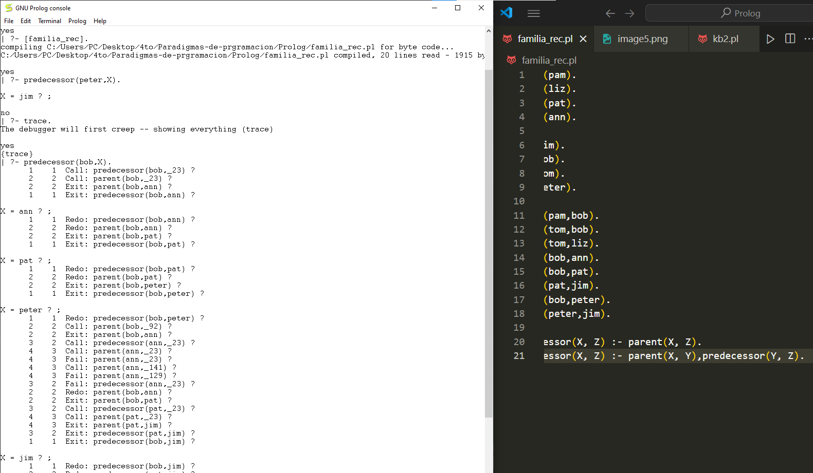

# PROLOG

### Alumno: Antonio Ramos Gonzalez
### Matricula: 372576
### Maestro: Carlos Gallegos
### Materia: Paradigmas de la programacion
### Fecha de entrega: 30 de mayo de 2024

#### Introduccion: PARADIGMA LOGICO

La programación lógica es un paradigma de programación en el que se utiliza la lógica formal para expresar los programas. Este enfoque se basa en la utilización de reglas y hechos lógicos para resolver problemas, en lugar de procedimientos imperativos.
Para esta actividad se nos encomendo realizar codigos en el lenguaje Prolog, siguiendo las 17 secciones de su tutortial, esto con el fin de comprender la programacion logica.

#### Desarrollo:
La presentacion de codigo comienza apartir de la seccion 4

##### Seccion 4.- HelloWorld: nos presenta el funcionamiento basico de Prolog

##### Seccion 5.- Basic: Presenta hechos, sintaxis y normas del lenguaje

##### Seccion 6.- Relations: nos presenta las relaciones

##### Seccion 7.- Data Objects: Presenta atomos y variables

##### Seccion 8.- Operators: muestra las distintas opereaciones que se pueden realizar

##### Seccion 9.- Loop & Decision Making: Creacion de ciclos

##### Seccion 10.- Conjunctions & Disjunctions

##### Seccion 11.- List: Presenta la creacion de listas y las ditintas acciones que se le pueden realizar a estas

##### Seccion 12.- Recursion and Structures: Presenta la recursion y explica arboles

##### Seccion 13.- Backtracking 

##### Seccion 14.- Different and Not: Pressenta los predicados de diferente y no, que comprueban si 2 argumetos son iguales o no

##### Seccion 15.- Intputs and Outputs: Presenta la escritura y lectura de archivos

##### Seccion 16.- Built-In Predicates: Predicados integrados en Prolog

##### Seccion 17.- Tree Data Structure: Se presenta la manera de implementar una estructura de arbol

#### Conclusion:
La programacion logica me proporciono un enfoque distinto a la hora de programar y en la resolucion de problemas, ofreciendo maneras intuitivas para lograrlo. Aunque es algo dificil de entender y por lo visto tiene areas de aplicacion muy especifica como la IA, preocesamiento de datos, entre otros.