# COMANDOS GIT
**Alumno: Antonio Ramos Gonzalez**
**Materia: Paradigmas de la programacion**

Durante esta practica de laboratorio se desarrollaron conocimientos sobre el empleo de comandos Git desde el uso de una terminal de comandos.

# Descrubiendo la terminal.
##### Se nos mostraron comandos basicos que se emplean en la terminal de comandos, como ls, ls -a, ls -tree, cd, cd ., cd .., pwd  

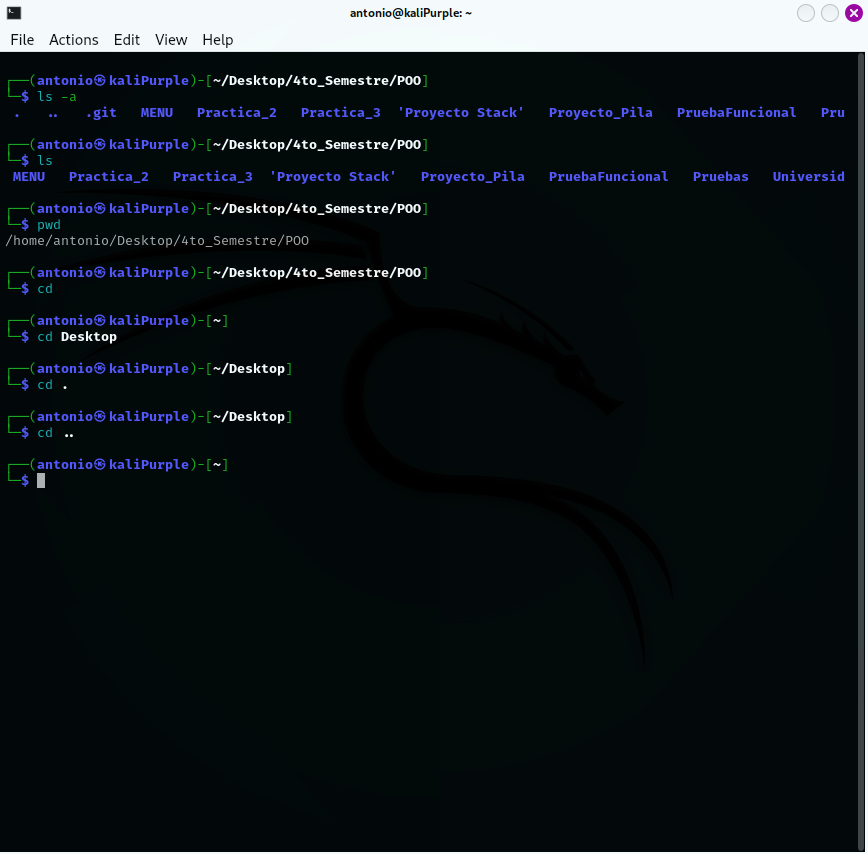

# Generar y subir repositorio
##### Una vez terminado el entendimiento de los comandos basicos de la linea de comandos iniciamos con el manejo de los comandos git.

##### Para ello creamos una carpeta y dentro de ella la inicializamos con el comando 
```Bash
 git init
```
##### para inicializar el repositorio. 

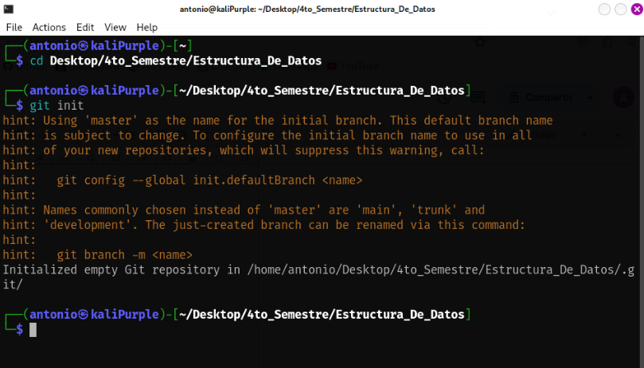

##### Posterior a esto visualizamos los archivos dentro de las carpetas que estan o no añadidos al repositorio con el comando 
```Bash
 git status
 ```
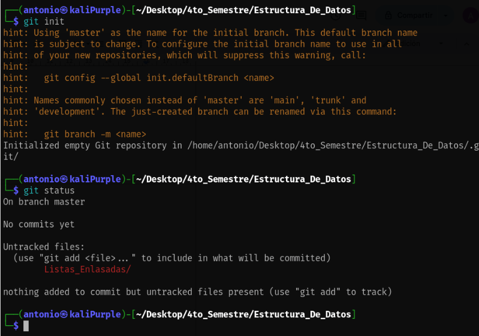

##### Ahora para a añadir los archivos dentro del documento al repositorio utilizamos el comando 
```bash
 git add direccion del archivo
 ```
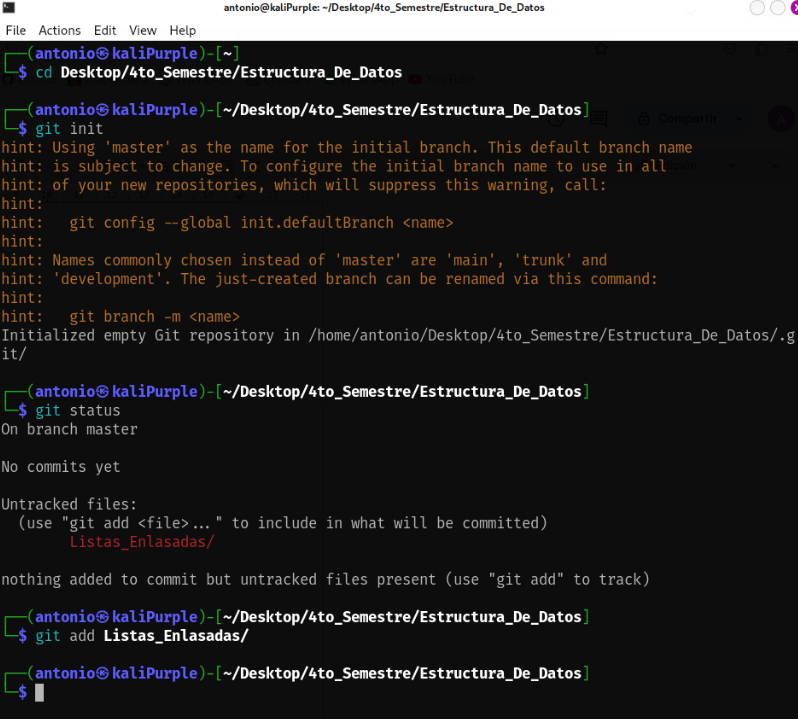

##### verificamos con el comando 
```bash
 git status
``` 
##### para ver que ya se añadieron los archivos al repositorio local
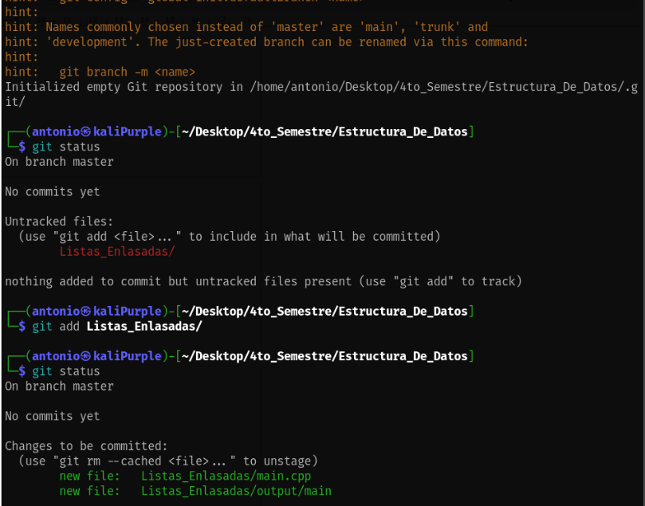

##### Ahora agregamos un comentario con el comando 
```bash
 git commit -m "Comentario"
```

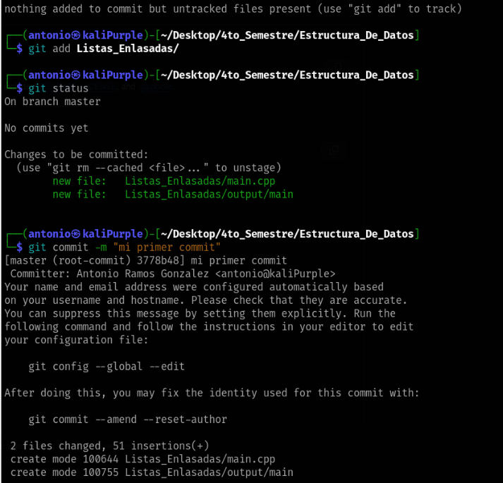

##### Para subir un este repositorio a github primeramente debemos crear un repositorio en GitHub para posteriormente enlazarlo con el comando 
```bash
 git remote add origin [codigo ssh de su repositorio] 
 ```
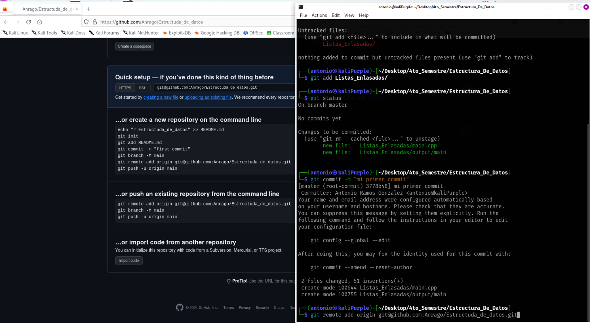

##### Y para terminar agregando este comando a nuestro repositorio de Github debemos usar el comando 
```bash
 Git push -u origin master 
```
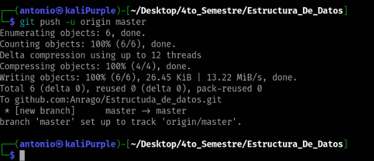

# Clonar repositorio y agregar nueva rama

##### Para clonar un reposito se obtuvo el codigo ssh del repositorio a clonar y con el comando 
```bash
 git clone [codigo ssh] [nombre carpeta] 
 ```
##### lo clonamos
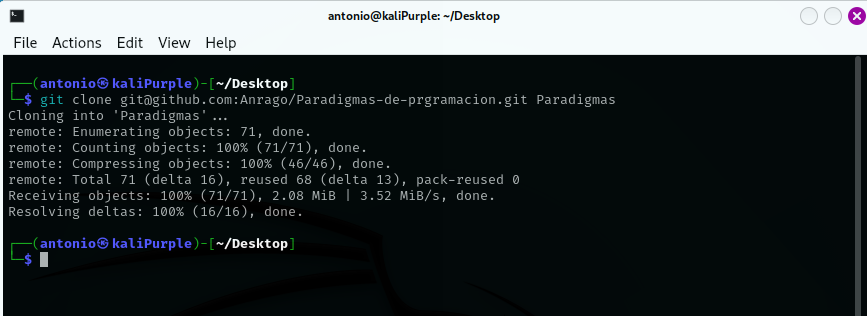
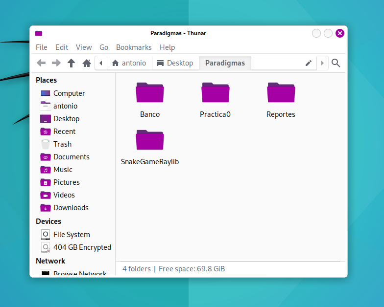

##### Para la creacion de una nueva rama dentro de un repositorio se hace usando el comando 
```bash
git checkout -b <NombreNuevaRama>
```

##### Una vez creada la nueva rama en nuestro repositorio local ingresamos a ella y abrimos el archivo .md que creamos en la rama principal, lo modificamos y añadimos a la nueva rama

```bash
git add .
git commit -m "Nueva Rama"
```
##### Y para terminar damos push a los cambios realizados desde nuestra rama

```bash
git push -u origin <NombreNuevaRama>
```
##### Si ingresamos a nuestro repositorio en GitHub podermos visualizar la nueva rama creada
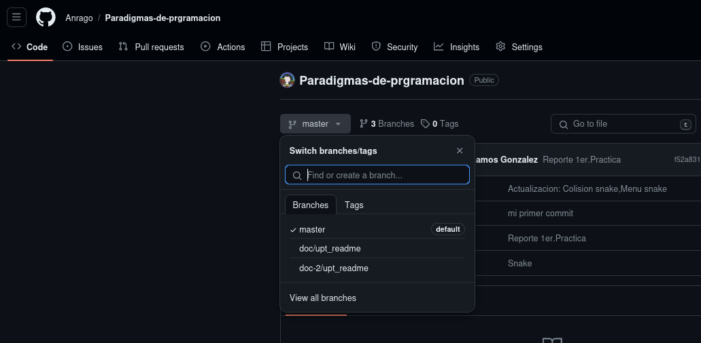
