# SML

### Alumno: Antonio Ramos Gonzalez
### Matricula: 372576
### Maestro: Carlos Gallegos
### Materia: Paradigmas de la programacion
### Fecha de entrega: 30 de mayo de 2024

#### Introduccion: PARADIGMA FUNCIONAL

La programacion funcional es una manera de programacion que trata la computacion como la evaluacion de funciones matematicas y evita cambiar el estado y los datos mutables. Esto contrasta con paradigmas vistos anteriormente.
Por eso para esta actividad se nos pidio realizar un recorrido por el repositorio de SML

#### Desarrollo:

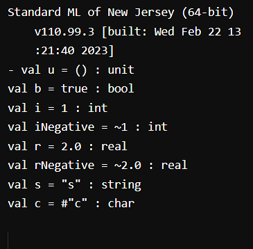
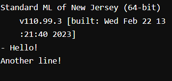
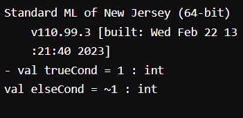
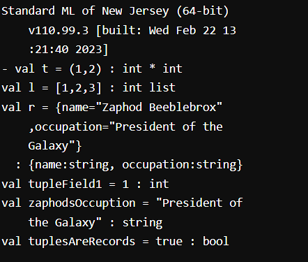
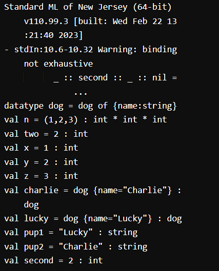
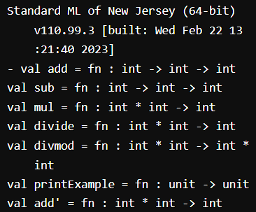
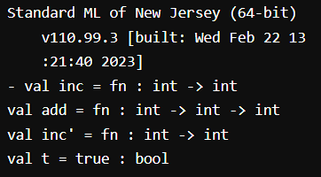
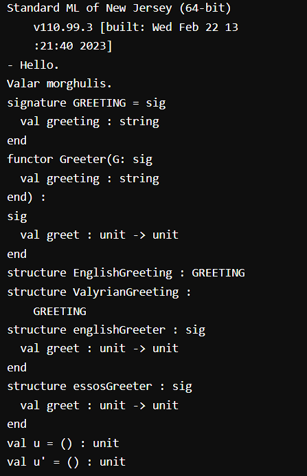
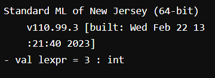
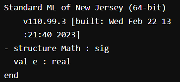
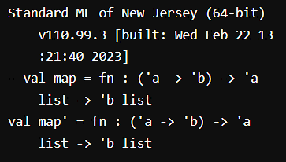
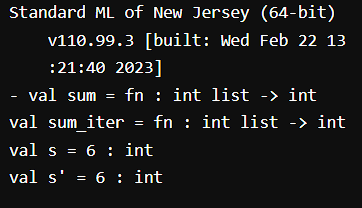
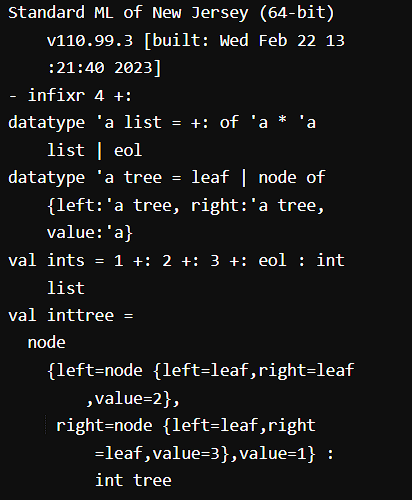
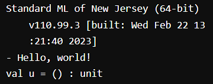
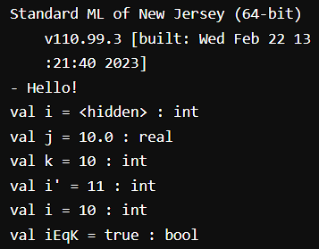

#### Conclusion:
El paradigma funcional es una herramienta poderosa para la programacion. Esta practica me permitio probar la programacion funcionl de primera mano, permitiendome ver su potencial y sus aplicaciones en distintas areas.

