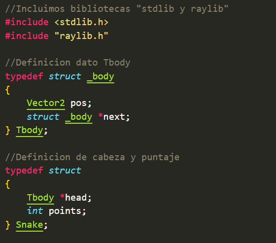
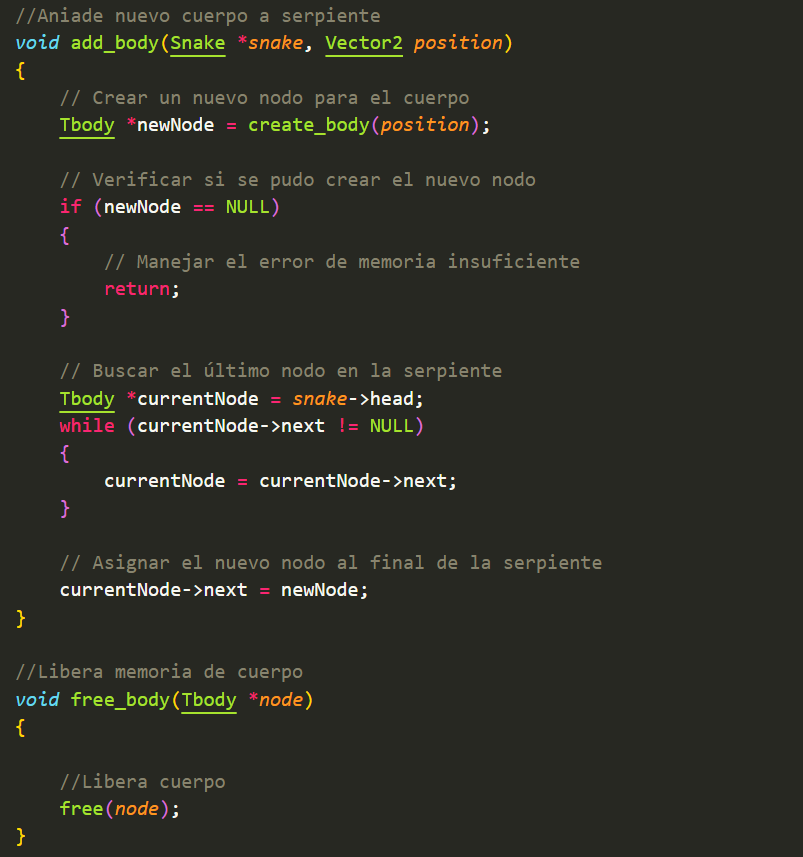
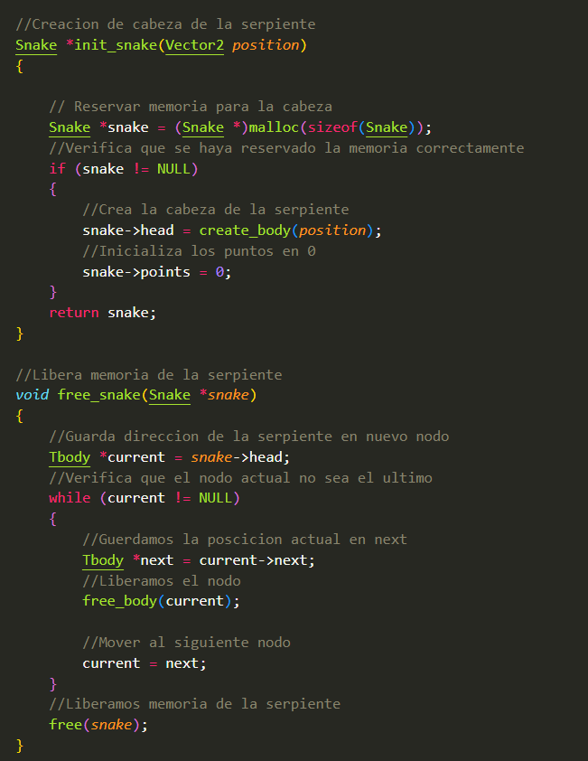
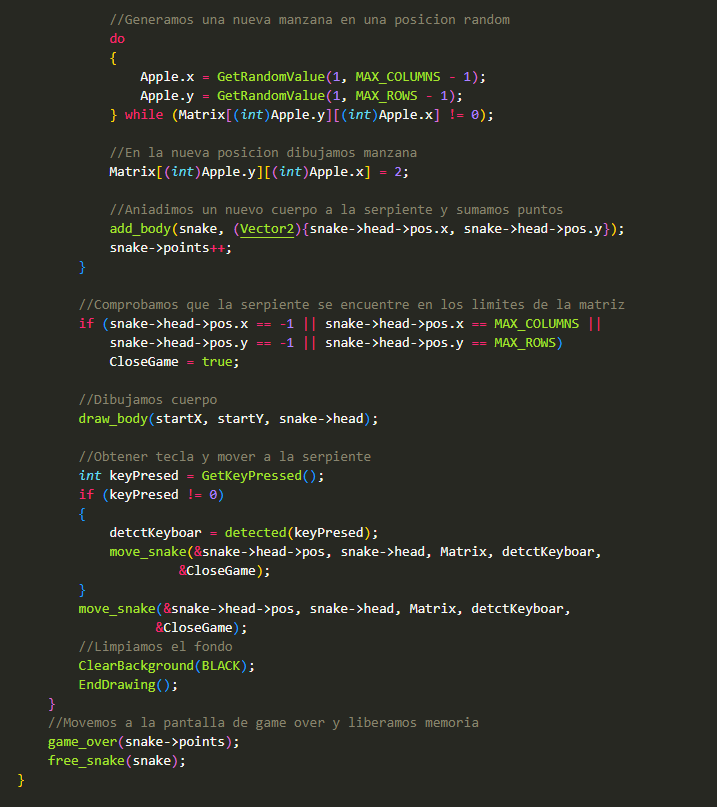
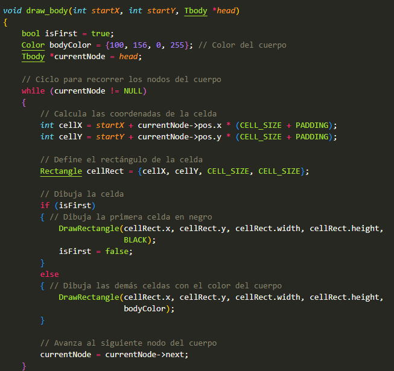

# Elementos fundamentales de los lenguajes de programación.

### Alumno: Antonio Ramos Gonzalez
### Matricula: 372576
### Maestro: Carlos Gallegos
### Materia: Paradigmas de la programacion
### Fecha de entrega: 30 de mayo de 2024
## SNAKE CON LISTAS ENLAZADAS Y RAYLIB

#### INTRODUCCION:
Existen una gran catidad de elementos que cunplen una funcion muy importante dentro de los lenguajes de programacion, facilitandonos el desarrollo de nuestros proyectos o programas

Para esta actividad se nos encomendo identificar dichos elementos fundamentales e implementarlos en la realizacion del mitico juego Snake.

#### Desarrollo:
Para el desarrollo de esta acitividad primeramente se hara uso del editor de codigo Visual Studio Code y la  interfaz grafica raylib para C/C++. El programa cuenta con el uso de listas enlazadas para el crecimiento de la serpiente y estara codificado siguienlo las reglas de estandar en C de Michael Barr.
En caso de querer descargar el juego al final del documento se presenta el link de descarga.

**1.-** Primemente en un archivo .h se definiran dos structs para la creacion de la serpiente. El primero llamado Tbody guardara la posicion del nodo actual y tendra un apuntador al siguinete nodo, mientras que el Snake tendermos un tipo de dato head que sera la cabeza y un contador de la puntuacion

**2.-** Ahora se definieron las funciones principalesd de nuestra lista o serpiente, siendo CreateBody la funcion para la creacion de un nuebo elemnto del cuerpo guardando su posicion actual, AddBody añadiendo el nuevo cuerpo al cuerpo principal, FreeBody liberando elemntos individuales del cuerpo, InitSnake la cual inicializa a la serpiente con una posicion inicial y el contador en 0 y por ultimo FreeSnake que se encarga de recorrer el cuerpo entero de nuestra serpiente para ir liberando cada elemento del mismo

**3.-** En el archivo C principal llamdo game.c es donde se funcionara el juego haciendo uso de nuestra libreria Snake.h declarada anteriormente. Tambien definiremos los parametros de nuestro juego, como el numero de columnas y filas, el tamaño en pixeles de las celdas de la matriz, la separacion entre celdas, la velocidad de la serpiente y la resolucion de la ventana a abrir 

**4.-** Ahora declaramos las funciones para el desarrollo del programa

**5.-** La funcion main sera la encargada de lo basico de nuestro juego , como inicializacion de la ventana del programa, presentacion del menu de juego y creditos

**6.-** La funcion BackRec dibuja los bordes del menu

**7.-** La funcion game es la funcion principal donde se ejecuta el juego. Dentro de ella se inicializa la serpiente, se generan las manzanas que se comera la serpiente para crecer, se dibuja la matriz, se detectan colisiones y se llaman a las demas funciones que se usan para la correcta ejecucion del codigo

**8.-** La funcion DrawMatrix se encarga de dibujar la matriz de juego y las manzanas

**9.-** La funcion DrawBody pinta los elementos de la serpiente

**10.-**La funcion Dectected devuelve un valor dependiendo de la tecla persionada, esto con el fin de direccionar correctamente a la serpiente

**11.-** La funcion GameOver nos muestra un menu para regresar al menu principal, asi como nuestra puntuacion actual vs nuestro record 

#### CONCLUSION
Esta parctica me ayudo acomprender en mayor medida el funcionamiento de los distintos elementos que son indispensables para la programacion, a si como reforzar mis conocimientos sobre el la aplicacion de listas enlazadas.

*Versiones de descarga:*
[WindowsVersion](https://drive.google.com/file/d/1MSZ8ZFtkEqbdxWlhnH9ZZAKJ4q0SkJ93/view?usp=sharing)
[LinuxVersion](https://drive.google.com/file/d/1LfmQ-rtPoQi0eiLIUrUo96iwov6C5HdC/view?usp=sharing)

Para ejecutar la version de **Windows** basta con descomprimir el archivo, ingresar a la carpeta y ejecutar game.exe
En caso de querer ejecutar la version de **Linux** primeramente tendras que instalar raylib en la computadora, para ello puedes acceder al siguiente link para [Instalar Raylib](https://www.youtube.com/watch?v=fJfmhhPMV40&t=99s).
Una vez instalado solo queda descomprimir el Snake-Linux.zip y ejecutar el game.exe